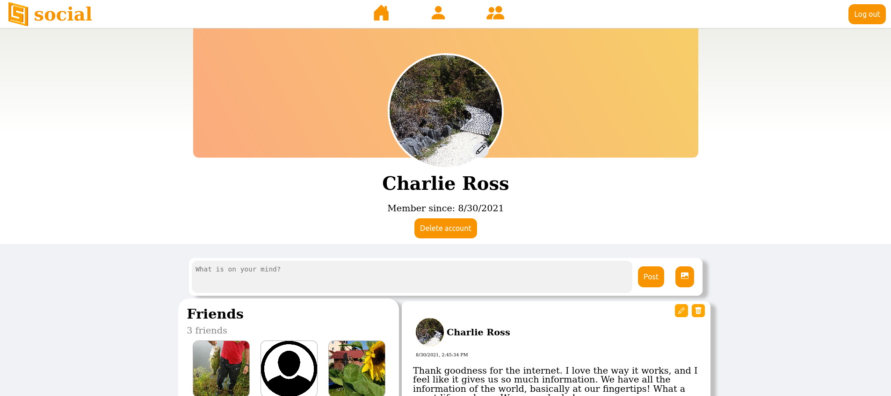

<!-- PROJECT LOGO -->
<br />
<p align="center">
  <a href="https://github.com/run-after/social-frontend">
    
  </a>

  <h3 align="center">Social</h3>

  <p align="center">
    A Facebook clone 
    <br />
    Created as part of The Odin Project (https://www.theodinproject.com/paths/full-stack-javascript/courses/nodejs/lessons/odin-book)
    <br />
    <a href="https://github.com/run-after/social-backend"><strong>Explore the docs »</strong></a>
    <br />
    <br />
    <a href="https://runafter-social.netlify.app">View Demo</a>
  </p>
</p>

<!-- TABLE OF CONTENTS -->
<details open="open">
  <summary><h2 style="display: inline-block">Table of Contents</h2></summary>
  <ol>
    <li>
      <a href="#about-the-project">About The Project</a>
      <ul>
        <li><a href="#built-with">Built With</a></li>
      </ul>
    </li>
    <li>
      <a href="#getting-started">Getting Started</a>
      <ul>
        <li><a href="#prerequisites">Prerequisites</a></li>
        <li><a href="#installation">Installation</a></li>
      </ul>
    </li>
    <li><a href="#contact">Contact</a></li>
    <li><a href="#acknowledgements">Acknowledgements</a></li>
  </ol>
</details>

<!-- ABOUT THE PROJECT -->

## About The Project

<a href="https://runafter-social.netlify.app">
  
</a>

<br />

This is the backend of a Facebook clone. The [frontend](https://github.com/run-after/social-frontend) makes API calls here.

### Built With

- [MongoDB](https://www.mongodb.com/)
- [Express](https://expressjs.com/)
- [React](https://reactjs.org/)
- [Nodejs](https://nodejs.org/)
- [AWS S3](https://aws.amazon.com/s3/)

<!-- GETTING STARTED -->

## Getting Started

To get a local copy up and running follow these simple steps.

### Prerequisites

Make sure you have npm and node installed

- console

  ```sh
  npm -v
  ```

  If you don't have npm installed, follow [this](https://docs.npmjs.com/downloading-and-installing-node-js-and-npm)

### Installation

1. Clone the repo
   ```sh
   git clone https://github.com/run-after/social-backend.git
   ```
2. Install NPM packages
   ```sh
   npm install
   ```
3. Set up [AWS S3](https://s3.console.aws.amazon.com/s3/home) for media storage (optional)

<!-- USAGE EXAMPLES -->

## Usage

The [frontend](https://github.com/run-after/social-frontend) makes API calls to create users, update users, create posts/comments, update posts/comments, upload images for avatar and image posts, like posts/comments, request friendships.

Using passport-js, this backend has protected routes only usable if the user is logged in and sends the JWT in the header.

Bcrypt is utilized to hash the password for each user.

The user model has personal information, including a hashed password, as well as whether the user is a facebook user or not. The user will be given a default avatar upon signup, then from the frontend, the user can upload their own photo to be used as an avatar. When the user delete's their account, or updates their avatar, their avatar photo is deleted, as long as the avatar photo is not the default one shared by other users. If a user is deleted, the associated friend requests, posts, comments, and likes will all be deleted as well.

Posts can be either a photo post, or a text post. The media from the photo posts are uploaded on AWS S3, and when deleted by the author, are then deleted from AWS S3. Posts are associated with users. If a post is deleted, the likes, and comments will also be deleted.

Comments are associated with users and posts. If a comment is deleted, then all likes of that comment will also be deleted.

Likes are associated with users and either a post or a comment.

All images are uploaded to S3 with multer-s3. The image URLs are then saved into the User model or Post model.

Cors is implemented to allow fetch calls from the seperate frontend.

## Contact

Chase - run.after@protonmail.com

Project Link: [https://github.com/run-after/social-backend](https://github.com/run-after/social-backend)
<br />
Live Link: [Social](https://runafter-social.netlify.app)

<!-- ACKNOWLEDGEMENTS -->

## Acknowledgements

- [amazon-s3-uri](https://www.npmjs.com/package/amazon-s3-uri)
- [aws-sdk](https://www.npmjs.com/package/aws-sdk)
- [bcryptjs](https://preview.npmjs.com/package/bcryptjs/v/1.0.1)
- [compression](https://www.npmjs.com/package/compression)
- [cors](https://www.npmjs.com/package/cors)
- [dotenv](https://www.npmjs.com/package/dotenv)
- [jsonwebtoken](https://www.npmjs.com/package/jsonwebtoken)
- [mongoose](https://www.npmjs.com/package/mongoose)
- [multer](https://www.npmjs.com/package/multer)
- [multer-s3](https://www.npmjs.com/package/multer-s3)
- [passport](https://www.passportjs.org/)
- [heroku](https://heroku.com)

From The Odin Project (https://www.theodinproject.com/paths/full-stack-javascript/courses/nodejs/lessons/odin-book)
